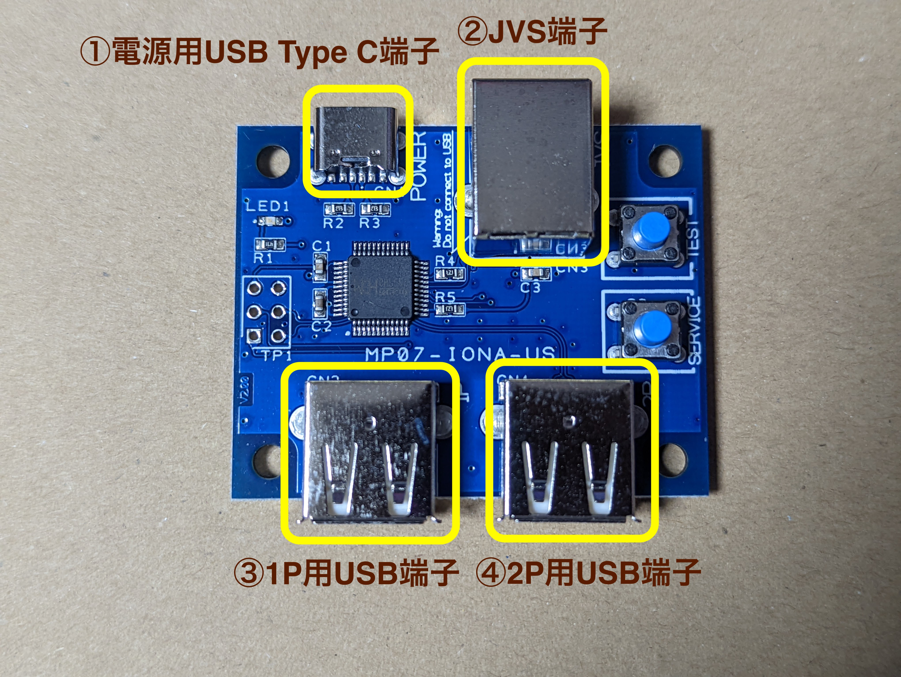
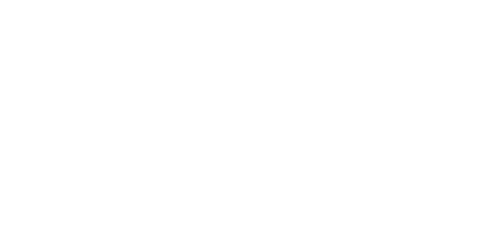
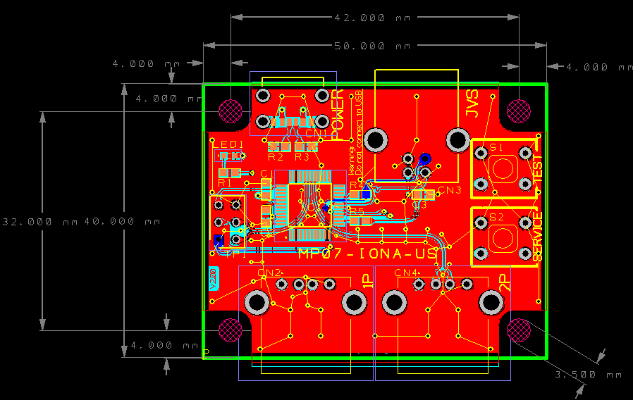

English version is [here](en)

---
# 取扱説明書
---

## 概要
JVS仕様の基板にUSBコントローラを接続するための変換基板です。
電源や映像・音声が標準規格を用いているexA-Arcadiaのような基板では、コントローラ入出力のみが特殊なI/Oとなっていますが、この変換基板を使うことでコントローラにも汎用品を用いる事ができるようになります。

## 互換性
### JVSシステム
[MP01-IONA-JS](../iona-js/)と同様に、現存するほぼ全てのJVSシステムに対応しています。また、現状ではnaomiの電脳戦機バーチャロン オラトリオ・タングラムの特殊レイアウトやスーチーパイIII等の麻雀レイアウトにも対応しています。詳細は後述のツインスティックモード、麻雀モードの説明を御覧ください。またガンコン3を接続した場合にはガンコンモードになります。

Ver 1.10基板でnamco系のボードから認識されない場合の[改造](mod)を紹介しています。トライフォースやSystem 2x6などが該当するようです。
この問題はVer 1.20基板以降では修正されています。

またVer 1.20基板以降では、標準のnamco系に対応した動作モードでは、一部のnaomi個体から認識されにくくなる報告があります。
もしnaomiやSEGA系の基板との接続がうまくいかない場合は、オプション設定でJVSデータ信号レベル補正を無効にて下さい。

ファームウェア Ver 1.30以降では、P1のアナログスティックX/Yをアナログ0,1に、P2のアナログスティックX/Yを2,3に割り当ててあります。Ver 1.31以降はガンコンモードが加わりました。

Ver 1.40以降では、P1の左アナログスティックX/Yをアナログ0,1に、右アナログスティックX/Yをアナログ2,3に、LT/RTがアナログ対応の場合はアナログ4,5に割り当ててありますが、アナログレイアウトで設定変更可能です。設定変更可能になったことからガンコンモードは廃止しました。

### USBコントローラ
Xbox 360、Xbox Oneシリーズ、PlayStation 4のほぼ全てのコントローラに対応していると思われます。またPlayStation 3やSwitchのコントローラでも確認できる範囲では対応しました。PlayStation 3向けのガンコン3にも対応しています。
USBコントローラの多くは個別の対応が必要なため、全てのコントローラをサポートしているわけではありませんが、可能な限り柔軟に対応するようファームウェアを作ってあります。コントローラの持つボタンの数にもよりますが、最大で1レバー10ボタンまで対応。レバーに関しては左アナログスティックと十字ボタン両方に対応しています。

もし未対応のコントローラがあった場合には、[報告](report)ページから連絡を頂ければ可能な限り対応したいと思います。

## 接続方法
### Ver 1.xx 基板

### Ver 2.xx 基板

①電源用micro USB端子またはUSB Type C端子からIONA-US用の電源をとります。データ通信は不要ですので充電専用のアダプタに接続しても構いませんし、他のホスト機のUSB端子からバス電力を供給してもらっても動作します。接続する機材によっては多くの電力を必要とするため、特にmicro USBの場合はPCからの供給では不安定になる可能性があります。

②JVS端子をJVSシステムの基板と接続します。一般的なタイプAオス-タイプBオスのUSBケーブルが利用できます。

③④にはUSBコントローラを接続できます。動作中でも随時抜き差しが可能です。

電源投入時にはLEDが高速点滅し、JVSバスからアドレスを設定され通信可能となったタイミングで点灯に変化します。JVSバスからリセット信号を受けた際には再度高速点滅を始めます。

## 機能
### ボタンレイアウト
12個までの物理ボタンをJVS上の任意のボタンに再配置できます。1つの物理ボタンを複数ボタンにアサインする事や、複数の物理ボタンを1つのボタンにアサインする事もできますので、同時押しボタンや連射専用ボタンなどが設定できます。

### 連射
物理ボタンごとに連射の設定ができます。速度は30/20/15/12/10/8.5から選択できます。JVSの仕様上、映像同期信号に合わせたシンクロ連射にはなりませんが、JVSバスと同期することでゲームの処理と同期したシンクロ連射が実現されています。

### 設定保存
最大10個までのレイアウト・連射設定を保存・呼び出しできます。電源投入時には最後に利用していた設定が呼び出されます。設定は1.40から導入されたアナログレイアウトとオプション設定を除き、1P用と2P用の個別に保存できます。
アナログレイアウトとオプション設定はP1用設定として保存されます。

### ファームウェア更新
バグ修正や互換性改善などの提供のためのファームウェア更新が利用可能です。特殊な装置を必要とせず、PCとUSB接続の上、Chromeから更新できます。

### ツインスティックモード
1P側のUSB端子にPS4系のコントローラを接続している場合、PSボタンを押すごとに通常モードとツインスティックモードが切り替わります。
ツインスティックモードでは、左アナログスティックとL1-3が1P側のコントローラに、右アナログとR1-3が2P側のコントローラにアサインされます。またボタン1が2P側のスタートボタンとして機能します。
このモードの配置は、タニタ製ツインスティックやPS4の2つのアナログスティックを使って電脳戦機バーチャロン オラトリオ・タングラムを遊ぶために調整されていますが、3ボタンまでのゲームを片手で遊んだり、一人で二人分の操作を行うダブルプレイを楽しむためにも使えます。

### 麻雀モード
Bootモード対応のキーボード（市販のキーボードはほぼ間違いなく対応していると思います）を接続すると、麻雀モードに切り替わります。
このモードではNAOMIの麻雀ゲームが想定するプロトコルに対応します。配列は一般的なものを採用し、A-Nはそのままアルファベットに対応、コインが5、スタートが1、カン・ポン・チー・リーチがそれぞれCTRL、ALT、SPACE、SHIFTに対応し、ロンがアルファベットのZに対応します。

### ガンコンモード
PS3用ガンコン3を接続すると、自動的にガンコンモードになります。銃口がX/Yとアナログ0,1に、A1ボタンがスタート、トリガーがボタン1にアサインされます。これはDeathCrimson OXに合わせた配置です。
Ver 1.40以降で廃止されました。ボタンレイアウトとアナログレイアウトを使って設定して下さい。

## 各種設定
### 設定モードの遷移
IONA-USは起動後に通常モードに入った後、基板上のTESTボタン、SERVICEボタンの組み合わせで、以下のように動作モードが遷移します。
#### Ver 1.00 〜 Ver 1.3x

#### Ver 1.40以降

### ①通常モード(LED - JVSバスの状態により点滅または点灯)
選択された設定でJVSバスに繋がったコントローラとして動作します。

### ②ボタンレイアウトモード（LED - 高速点滅）
TESTとSERVICEボタンを同時押しする事で、設定モードに入ります。
ファームウェアVer 1.22以降ではレイアウトモードに入るには0.5秒以上同時押しする必要があります。
Ver 1.40以降では0.5秒〜5秒の間、両ボタンを押し続ける必要があります。
同時押しは、両方のボタンが同時にONとなるタイミングがあれば、同時でなくとも（例えばTESTを押しっぱなしにしながらSERVICEを押すなどでも）大丈夫です。

ボタンレイアウトモードでは、コイン、スタート、ボタン１〜１０の順で、これらのボタンに対応する物理ボタンを選択していきます。同時押しする事で、複数の物理ボタンを１つのボタンにアサイン可能です。ここでも同時押しは、押すタイミング、離すタイミングがずれていても問題ありません。一度ボタンが押されたら、全てのボタンが離されたタイミングでそのボタンの設定が確定し、次のボタン設定入力に備えます。１２個のボタン全てについて順次設定してください。途中でこのモードを抜けた場合、それ以降のボタンについては物理ボタンがアサインされません。例外として、１つもボタンを設定しなかった場合は、設定を変更せずに次のモードに移行します。

### ③連射ボタン設定モード（LED - 点滅）
連射をオンにしたい物理ボタンを同時押しします。同時押しの概念については同様で、全てのボタンが離されたタイミングで設定が保存されます。次のモードに遷移するまで何度でも再設定できます。

### ④連射速度設定モード（LED - 低速点滅）
連射速度をボタン１〜６で選択します。ここでのボタンは物理ボタンではなく、レイアウト設定に従った、JVS上でのボタン番号です。ボタン1から順に連射速度30/20/15/12/10/8.5に対応します。何度でも選択可能です。同時押しは意味がありませんので、仮に同時に押された場合には速度の速い方が選択されます。離すタイミングが異なった場合、最後に離した方が選択されます。

以上の設定は、現在選択中の設定に対して恒久的に変更がなされます。

### ⑤設定初期化（LED - 瞬間的に点滅）
設定モードのいずれかにいる際に、もう一度TESTとSERVICEを同時押しする事で、Flashに保存された全てのレイアウト・連射設定を初期化し、出荷時の状態に戻します。
初期化後は自動的に通常モードに戻ります。

### ⑥設定呼び出しモード(LED - 消灯)
設定モードのいずれかにいる際に、SERVICEボタンを押す事で設定呼び出しモードに入ります。
ボタン１〜１０を押す事で、各ボタンに対応する設定が呼び出されます。初期状態ではボタン１の設定が利用されています。またボタンは物理ボタンではなく、レイアウト設定されたJVS上でのボタン番号です。
再びSERVICEボタンを押すまで何度も選択できます。
Ver 1.40より古いファームウェアではSERVICEボタンで通常モードに戻ります。Ver 1.40以降ではTESTボタンでアナログレイアウトモードに移行します。

### ⑦アナログレイアウトモード(LED - 高速点滅)
アナログ信号にアサインする6つの入力を順次指定します。
モードに入った際の入力値を中央値として記憶していますので、割り当てたいコントローラの入力が大きくなる方向に操作します。
通常ではスティックなら下や右方向、トリガーなら押下方向が正の方向です。必要に応じて反対方向を入力する事で極性が反転します。
この入力状態から再び中央地付近まで戻すと、最後に操作していた入力と方向を採用します。
以上の操作をアナログ1から6まで6回分行って下さい。途中でTESTボタンを押せば未設定部分は変更されません。

### ⑧オプション設定モード(LED - 点滅)
TESTボタンで設定を抜けます。この時の1Pボタンの状況により、動作モードを以下の通りに変更します。ボタンはレイアウト後の論理番号です。
標準設定では全てOFFになります。

|1|2|3|4|5|6|対応バージョン|機能|
|-|-|-|-|-|-|-|-|
|OFF|OFF|-|-|-|-|1.40|デバイス名の問い合わせに対し、SEGA互換のI/Oを名乗る|
|ON|OFF|-|-|-|-|1.40|デバイス名の問い合わせに対し、namco JYU互換のI/Oを名乗る (*1)|
|ON|ON|-|-|-|-|1.41|デバイス名の問い合わせに対し、namco NA-JV互換のI/Oを名乗る (*2)|
|-|-|OFF|-|-|-|1.40|JVSデータ信号レベル補正を有効にする(*3)|
|-|-|ON|-|-|-|1.40|JVSデータ信号レベル補正を無効にする(*3)|
|-|-|-|OFF|-|-|1.41|ロータリ入力をサポートしない|
|-|-|-|OFF|-|-|1.41|ロータリ入力をサポートする|
|-|-|-|-|OFF|-|1.41|画面ポジション入力をサポートしない|
|-|-|-|-|ON|-|1.41|画面ポジション入力をサポートする|
|-|-|-|-|-|OFF|1.41|アナログ0,1をレバーにも割り当てる|
|-|-|-|-|-|ON|1.41|アナログ0,1をレバーには割り当てない|

(*1) Ninja Assaultで認識されるために必須の設定です。

(*2) Star Wars: Battle Pod向けに実験中の設定です。

(*3) 1.43以降、TESTボタンを押しながら起動する事で現在の設定が反転します。

### 設定のポイント
レイアウトと連射をうまく設定する事で、３ボタン用のゲームを通常の３ボタン＋連射対応の３ボタンの計６ボタンに配置する事もできます。この場合では、レイアウト設定でコイン、スタート、ボタン1+4、ボタン2+5、ボタン3+6、……と設定し、連射でボタン4+5+6を設定します。
あるいは、レイアウト設定で、コイン、スタート、ボタン1+4、ボタン2+4、ボタン3+4、……と設定すれば、ボタン4がボタン1+2+3の同時押しボタンとして機能します。

## バージョンについて
### 基板のバージョン
- 過去にVer 1.10、1.20が出荷され、今後は2.00のみ出荷されます。

### ファームウェアのバージョン
- 最新版ではVer 1.44が初期状態で書き込まれています。バージョンはデバイス名として確認可能です。
- ファームウェアは[ファームウェア](firmware)ページから任意のバージョンに更新可能です。

## おまけ情報
### 固定用の穴について
Ver 2.00基板では固定用のネジ穴があります。基板の形状データは以下のとおりですので参考にして下さい。
ネジ穴の大きさはΦ3.5になります。

### ケースについて
Ver 1.xx基板、Ver 2.00基板それぞれについてケースを自作してデータを公開しているユーザーがいるので紹介させてください。
- [MP07-IONA-US Case](https://www.thingiverse.com/thing:5251839) for Ver 1.xx by Zepherino
- [MP07-IONA-US USB-C Case](https://www.printables.com/model/159069-mp07-iona-us-usb-c-case) for Ver 2.00 by thenullray

### JVS互換性に関する技術的詳細
IONAとJVSボードの間で発生する互換性の問題は大きく分けて2種類あります。

1つはJVS上のネゴシエーションで合意に至らないケースです。
JVSに対応したゲームはIONAと通信して、ゲームに必要な機能が実装されているか確認します。この際I/Oボードの名前で判断するタイトルも少なくはありませんし、機能が豊富すぎる際にバッファオーバーランなどが発生してバグってしまうゲームもそれなりに存在します（ハックしたい人には朗報！）。これらの問題を回避するためにIONAは名前を変更したり、利用できると宣言できる機能を制限したりする設定を持っています。

もう1つは電気的な相性で通信が成立しないケースです。こちらの原因はIONA-USにあります。
JVSではデバイスの接続を確認するSENSE信号の他に、D+/D-の対になるデータ信号を用いており、電気的にはEIA-RS485に従っています。
EIA-RS485では12Vから-7Vまでの電圧でD+/D-の電位差が±0.2V以上あれば良く、非常に広い条件の信号を受信できる必要があります。
一方IONAが用いているマイコンのI/Oは5Vトレラント、3.3V動作で、2.0V以上をHIGHとして認識します。
485と比べ非常に狭い動作レンジなのですが、現実的には多くのJVSは5V-0Vで動作するため問題ありません。
ただ、一部のボードでは2.5Vを中心に小さい電位差で信号を送ってくる事があり、この場合HIGH/LOWともに2.0V以上となりIONA側で入力を一切検知できない事があります。
この問題に対処するのが信号レベル補正機能で、有効にする事で入力信号を分圧し、LOW信号が検出可能なレンジまで下がります。
ただし、あくまでも現実的な範囲での対処であるため、前述の485のフルのレンジには対応しきれていません。
出力に変化はありませんので、対抗ボードへのダメージを心配する必要はありません。

## 問い合わせ
質問は[Twitter](https://twitter.com/toyoshim)等で声をかけて頂ければできる限りお答えします。
相性問題の報告やUSBコントローラの対応要望、機能追加のアイデアどもあればぜひご連絡ください。
