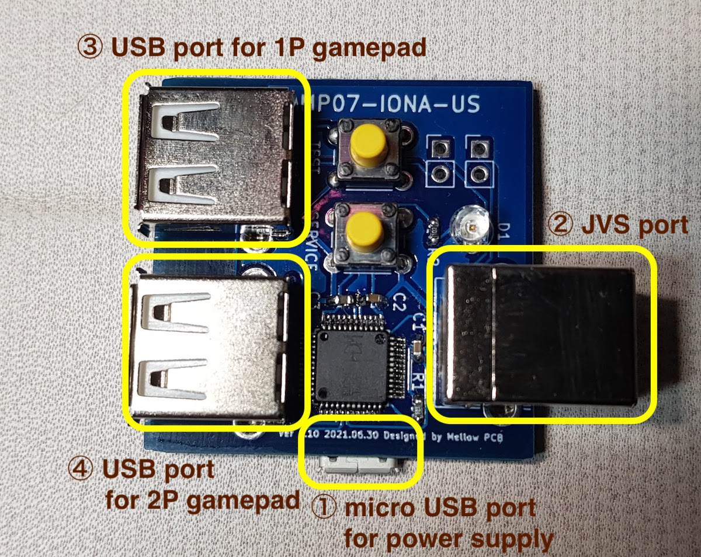
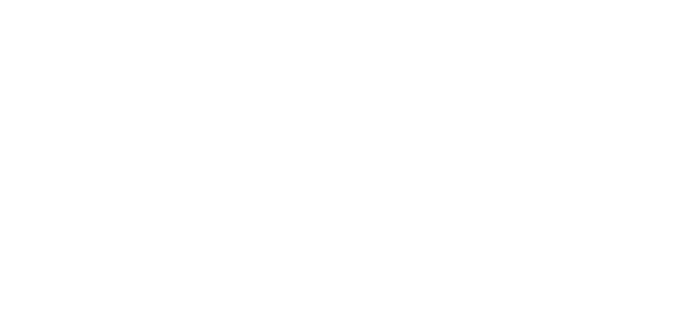

日本語版サイトは[こちら](./)

---
# Manual
---

## Overview
IONA-US is a board to connect USB gamepads to JVS based arcade systems.
For JVS based system having standard power supply, video and audio outputs, such as exA-Arcadia, controller I/O is the only incommon interface for end users. But with this small board, you can use standard USB gamepads to play games.

## Compatibility
### JVS Systems
Like the previous product, [MP01-IONA-JS](../iona-js/), it support almost all JVS based systems. Also, now it supports special I/O layouts such as Cyber Troopers Virtual-On Oratorio Tangram for NAOMI and Mahjong mode used by e.g. Idol Janshi Suchipai III for NAOMI. See later sections to know how these mode works.

### USB Gamepads
It's expected to support all controllers for Xbox 360 and One serices, and many controllers for PS4. Also, some controllers for PS3 and Switch will be available.
Usually each USB gamepad requires a special treatment to handle it correctly, IONA could not support all devices, but the firmware is designed as flexible to be able to handle as many controllers as possible.
It supports 1 lever and 10 buttons at maximum. Both left analog stick and D-Pad are assigned to the lever. 
If your gamepad isn't available, you can request supporting it from the [Report](report_en) page.

## How to use

① Connect micro USB port for power supply. It doesn't need data connection as it's just expected to suupply 5V power for IONA. USB charger will be available. Of course, PC USB port can support the required power. PC-based JVS system board could have a port for this use, e.g. exA-Arcadia has hidden USB ports.

② Connect JVS port to the JVS system board. You can use a general USB cable.

③④ Connect USB gamepads at any time. You can connect and disconnect even during the JVS bus is active.

When power is supplied, LED starts blinking. Once an address is assinged via JVS bus, LED gets on. It will start blinking again if IONA receives reset signal via JVS bus.

## Features
### Custom Button Layout
You can map at most 10 physical buttons to arbitrary logical buttons for JVS. You can map one physical button to multiple JVS buttons, or map multiple buttons to one JVS button. It helps you to realize a button to push multiple buttons together, or to assign addition button for rapid-fires.

### Rapid-fire
You can enable rapid-fire mode per each physical button. You can choose the speed from 30/20/15/12/10/8.5. This can not be synchronized with the video sync signal as JVS does not bring it, but as it's synchronized with the JVS bus polling, it's virtually synchronized with each frame update.

### Persistent Configurations
You can store and restore at most 10 configuration sets of button layout, rapid-fire settings, and it's speed. When IONA boots, the last configurations are automatically restored.

### Firmware Updates
For bug fixes, or to improve compatibility, firmware updates are available. You don't need any special equiment to burn firmwares, but all you have to do is to connect IONA to PC over USB, then visit the support site by Google Chrome.

### Twinstick Mode
When a PS4 controller is connected to the 1P USB port, pushing PS button switch operation mode between the normal mode and the twinstick mode.
In the twinstick mode, left analog stick and L1-3 buttons are assigned as 1P controllers, and right analog stick and R1-3 are assigned as 2P controllers. Button 1 is also assigned as 2P start button. This layout is designed to play Cyber Troopers Virtual-On Oratorio Tangram for NAOMI with TANITA twinstick or PS4's two analog sticks. If you are a hero, you can enjoy solely playing both 1P and 2P together by 1 gamepad.

### Mahjong Mode
When a USB keyboard supporting boot mode, though almost all keyboards will support, is connected, IONA switches to mahjong mode.
In this mode, the layhout is adjusted to play with mahjong games for NAOMI. Key assignments are compatible with MAME. A-N are mapped to A-N, 5 is for coin, 1 is for start, ctrl, alt, space, shift are for Kan, Pon, Chi, Reach, then Z is for Ron.

## Settings
### Transit operation modes

On boot, IONA runs in the normal mode. Operation modes are transited by pussing TEST and SERVICE buttons on the IONA board.

### ① Normal mode (LED - blink or on, depending on JVS bus state)
Works as a JVS I/O controllers with chosen settings.

### ② Layout config mode (LED - fact blink)
On pushing TEST and SERVICE together, it enters the layout config mode.
You don't need to push them exactly together, e.g. keeping TEST down and clicking SERVICE will work.

In the button layuout mode, you will choose physical buttons in the following order, coin, start, button1 to 10. If you push multiple buttons together, you can assign multiple physical buttons into one button. You don't need to push them at the eaxctly timing as well. When you press a button, IONA starts recording all pressed buttons until all buttons are released, then assign them all to the target button. You continue this sequence until all 12 buttons are mapped. If you leave this mode before settings all, remaining buttons are remained to have no assignment. If you configure no button, exceptionally IONA doesn't update layout at all and move to the next mode.

### ③ Rapid-fire config mode （LED - blink）
You can press multiple physical buttons for which rapid-fire is enabled. Similarly, timing should not be exact. You can try multiple time until existing from this mode.

### ④ Speed config mode （LED - slow blink)
You can choose rapid-fire speed by button 1 - 6. Button 1 - 6 does not mean the physical buttons, but buttons mapped in the custom layout. Each button 1 - 6 are mapped to 30/20/15/12/10/8.5 fps. You can try any time until exiting from the mode. If you push multiple buttons, faster speed is taken. If release timing differs, the latter one is taken.

Chosen settings above will be stored persistently.

### ⑤ Factory reset (LED - flash)
You can reset all settings and restore default settings by pressing TEST and SERVICE together outside the normal mode. LED flashes, then go back to the normal mode automatically.

### ⑥ Call store config (LED - off)
You can enter the mode to call stored config by pushing SERVICE button outside the normal mode.
Pressing button 1 - 10 in the custom layout recall the configuration set 1 - 10.
Initial set for the factory setting is 1.
You can recall another config again until exiting the mode by pressing SERVICE again.

### Tips
You can craft layout and rapid-fire settings for 3 button games to have another 3 for rapid-fires. For instance, you can map coin, start, button1+4, button2+5, button3+6, ..., then enable rapid-fires for button4+5+6.
If you want to have an extra button to press button 1+2+3 at the exactly same time, you can map coin, start, button1+4, button2+4, button3+4, ..... Thus, button 4 is configured for the combination of button1+2+3.

## Versions
### PCB version
- All shipped version is Ver 1.10.

### Firmware version
- The first batch for Europe is Ver 1.20.
- You can burn the latest or old firmwares at [Firmware Update](firmware_en) page.

## Contact
Feel free to ask questions at [Twitter](https://twitter.com/toyoshim).
Reports for compatibility issues, requests to support more devices, or any ideas are welcomed.
