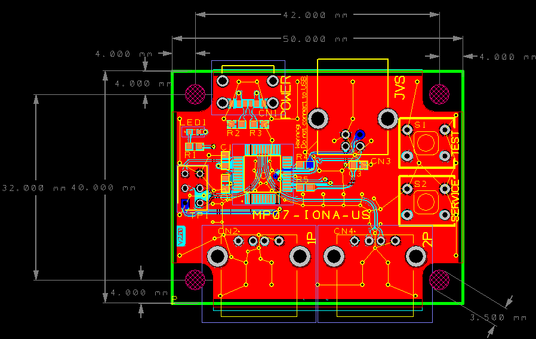

日本語版サイトは[こちら](./)

---
# Manual
---

## Caution
Following instructions contain version dependent information. You need to pay
attention that there are two kind of versions, one is for PCB, and the other is
for firmware. Any PCB can use the latest firmware as you want.

## Overview
IONA-US is a board to connect USB gamepads to JVS based arcade systems.
For JVS based system having standard power supply, video and audio outputs, such as exA-Arcadia, controller I/O is the only incommon interface for end users. But with this small board, you can use standard USB gamepads to play games.

## Compatibility
### JVS Systems
Like the previous product, [MP01-IONA-JS](../iona-js/), it supports almost all JVS based systems. Also, now it supports special I/O layouts such as Cyber Troopers Virtual-On Oratorio Tangram for NAOMI, Mahjong layout used by e.g. Idol Janshi Suchipai III for NAOMI, whell and padals for racing games, and zapper for shooring.

If Ver 1.10 based PCB isn't recognized by namco's system board, this [mod](mod_en) will solve the stability issue.
Triforce and System 2x6 may have this compatibility issue.
This issue was solved in Ver 1.20 and later PCBs.

Ver 1.20 and later PCBs activate namco compatible signal mode by default. But there are a few reports that this mode
causes a connectivity issue with a certain lot of naomi.
__If you have a connectivity issue with naomi or SEGA boards, you can inactivate this signal level adjustment in the option config mode.__
__We also know that exA-Arcadia shows I/O Errors on launching a newer title that supports JVS Dash even if the system menu works with the setting activated.__ Inactivating the adjustment option solves the issue.
You can flip the adjustment setting by booting IONA with TEST button pressed, and the change is stored into the persistent storage. You can revert it again by doing the same operation on booting.

From firmware 1.30, P1's X/Y axies are assigned to analog 0,1, and P2's X/Y axies are done to analog 2,3.  Guncon mode is also added at 1.31.

From firmware 1.40, P1's left X/Y axies are assigned to analog 0,1, right X/Y axies are assigned to anlog 2,3, nad LT/RT are assigned to analog 4,5, but you can customize the map via analog layout config mode. As of this customizability, 1.40 and later deprecate the zapper mode.

### USB Gamepads
It's expected to support all controllers for Xbox 360 and One serices, and many controllers for PS4. Also, some controllers for PS3 and Switch will be available. Guncon3 for PS3 is also available.
Usually each USB gamepad requires a special treatment to handle it correctly, IONA could not support all devices, but the firmware is designed as flexible to be able to handle as many controllers as possible.
It supports 1 lever and 10 buttons at maximum. Both left analog stick and D-Pad are assigned to the lever. 
If your gamepad isn't available, you can request supporting it from the [Report](report_en) page.

## How to use
### Ver 1.xx PCB

### Ver 2.xx PCB

① Connect micro USB or USB Type C port for power supply. It doesn't need data connection as it's just expected to suupply 5V power for IONA. USB charger will be available. Of course, PC USB port can support the required power. PC-based JVS system board could have a port for this use, e.g. exA-Arcadia has hidden USB ports. But if you want to use a device that requires much power, supplying via USB Bus from PC may not be enough and IONA gets to be unstable.

② Connect JVS port to the JVS system board. You can use a general USB cable.

③④ Connect USB gamepads at any time. You can connect and disconnect even during the JVS bus is active.

When power is supplied, LED starts blinking. Once an address is assinged via JVS bus, LED gets on. It will start blinking again if IONA receives reset signal via JVS bus.

## Features (Firmware v2.xx)
### Customize Settings
[Setting](setting_en) page allows you to configure 6 sets of your customized settings. You can call one of the 6 sets on using the device. Each set contains
- Device name declared to the host
- Supported features declared to the host (e.g., how many analog inputs, how many bits for each input)
- Button map from each button to any combination of P1 and P2 switches.
- Rapid fire assignment
- Rapid fire definitions (patterns and cycles)
- A map from analog sticks and triggers, to lever, or various analog inputs

### Select a Setting
To enter the setting selection mode, press TEST and SERVICE for about 1 second.
Click TEST to take the next setting, and click SERVICE to decide the current setting and get back to the normal mode.
You can know the setting id as the LED blinks N times on deciding the Nth set.

If you see continuous 3times LED blinks, setting data will not be initialized, or broken. Please initialize it at [setting](setting_en) page.

### Zapper Calibratrion Mode
There are some titles that uses TSS-I/O mode and they don't provide zapper calibration.
As a workaround, IONA provides a built-in zapper calibration mode.
Pressing TEST and SERVICE for 3 seconmds to see the LED gets off, and blinks again.
Now the device is in calbration mode.
You can shoot 4 corners on your monitor in your favorite order to complete the calibration.
Settings such as currently selected configuration, or calibration data are stored persistently.

## Features (Firmware v1.xx)
### Custom Button Layout
You can map at most 12 physical buttons to arbitrary logical buttons for JVS. You can map one physical button to multiple JVS buttons, or map multiple buttons to one JVS button. It helps you to realize a button to push multiple buttons together, or to assign addition button for rapid-fires.

### Rapid-fire
You can enable rapid-fire mode per each physical button. You can choose the speed from 30/20/15/12/10/8.5. This can not be synchronized with the video sync signal as JVS does not bring it, but as it's synchronized with the JVS bus polling, it's virtually synchronized with each frame update.

### Persistent Configurations
You can store and restore at most 10 configuration sets of button layout, rapid-fire settings, and it's speed. When IONA boots, the last configurations are automatically restored. All settings except for analog layout and options that are introduced at Ver 1.40 are per-player settings. Analog layout and options are common settings, but tied with the P1 settings and stored/recalled as a part of P1 settings together.

### Firmware Updates
For bug fixes, or to improve compatibility, firmware updates are available. You don't need any special equiment to burn firmwares, but all you have to do is to connect IONA to PC over USB, then visit the support site by Google Chrome.

### Twinstick Mode
When a PS4 controller is connected to the 1P USB port, pushing PS button switch operation mode between the normal mode and the twinstick mode.
In the twinstick mode, left analog stick and L1-3 buttons are assigned as 1P controllers, and right analog stick and R1-3 are assigned as 2P controllers. Button 1 is also assigned as 2P start button. This layout is designed to play Cyber Troopers Virtual-On Oratorio Tangram for NAOMI with TANITA twinstick or PS4's two analog sticks. If you are a hero, you can enjoy solely playing both 1P and 2P together by 1 gamepad.

### Mahjong Mode
When a USB keyboard supporting boot mode, though almost all keyboards will support, is connected, IONA switches to mahjong mode.
In this mode, the layhout is adjusted to play with mahjong games for NAOMI. Key assignments are compatible with MAME. A-N are mapped to A-N, 5 is for coin, 1 is for start, ctrl, alt, space, shift are for Kan, Pon, Chi, Reach, then Z is for Ron.

### Zapper Mode
If you connect guncon3 for PS3, zapper mode will be activated automatically.
Gun's direction will apear as X/Y and analog 0,1, and A1 will be assigned to the start button. Trigger will be mapped to the button 1.
This is aligned with what DeathCrimson OX wants.
This mode is deprecated at Ver 1.40. You can use the analog layout settings instead.

## Settings
### Transit operation modes
On boot, IONA runs in the normal mode. Operation modes are transited by pussing TEST and SERVICE buttons on the IONA board.
#### Ver 1.00 through to Ver 1.3x

#### Ver 1.40 and later

### ① Normal mode (LED - blink or on, depending on JVS bus state)
Works as a JVS I/O controllers with chosen settings.

### ② Layout config mode (LED - fast blink)
On pushing TEST and SERVICE together, it enters the layout config mode.
After firmware ver 1.22, you need to press them together over 0.5 second to enter the layout config mode.
After firmware ver 1.40, you need to press both for at least 0.5 and at most 5 seconds together.
You don't need to push them exactly together, e.g. keeping TEST down and clicking SERVICE will work.

In the button layuout mode, you will choose physical buttons in the following order, coin, start, button1 to 10. If you push multiple buttons together, you can assign multiple physical buttons into one button. You don't need to push them at the eaxctly timing as well. When you press a button, IONA starts recording all pressed buttons until all buttons are released, then assign them all to the target button. You continue this sequence until all 12 buttons are mapped. If you leave this mode before settings all, remaining buttons are remained to have no assignment. If you configure no button, exceptionally IONA doesn't update layout at all and move to the next mode.

### ③ Rapid-fire config mode （LED - blink）
You can press multiple physical buttons for which rapid-fire is enabled. Similarly, timing should not be exact. You can try multiple time until existing from this mode.

### ④ Speed config mode （LED - slow blink)
You can choose rapid-fire speed by button 1 - 6. Button 1 - 6 does not mean the physical buttons, but buttons mapped in the custom layout. Each button 1 - 6 are mapped to 30/20/15/12/10/8.5 fps. You can try any time until exiting from the mode. If you push multiple buttons, faster speed is taken. If release timing differs, the latter one is taken.

Chosen settings above will be stored persistently.

### ⑤ Factory reset (LED - flash)
You can reset all settings and restore default settings by pressing TEST and SERVICE together outside the normal mode. LED flashes, then go back to the normal mode automatically.

### ⑥ Call store config (LED - off)
You can enter the mode to call stored config by pushing SERVICE button outside the normal mode.
Pressing button 1 - 10 in the custom layout recall the configuration set 1 - 10.
Initial set for the factory setting is 1.
You can recall another config again until exiting the mode by pressing SERVICE again.
It returns to the normal mode if the firmware is older than 1.40 by pressing SERVICE. Otherwise, ver 1.40 and later, pressing TEST moves to the analog layout config mode.

### ⑦ Analog layout config mode (LED - fast blink)
You can choose 6 inputs for analog signal reports.
Analog input values are remembered as base values when you enter this mode.
You can move an analog stick or a trigger that are recognized as analog inputs.
You may want to move it right, down, or pushed for normal polarity.
If you want to revese it, you can move it toward the opposite side.
Once you stop moving the stick or the trigger and make it return to the original position, the input was recorded.
You need to repeat the same steps for analog input 1 to 6, 6 times.
You can quit this mode by pressing TEST, and following assignments are just skiped and previous settings are uised.

### ⑧ Options config mode (LED - blink)
You can quit the settings mode by pressing TEST, but options will be set via P1 buttons on quiting the mode as below.
The button number is logical one based on your customized layout. Default settings are all-off.

|1|2|3|4|5|6|7|8|Supported Version|Function|
|-|-|-|-|-|-|-|-|-|-|
|OFF|OFF|-|-|-|-|-|-|1.40|Declare SEGA compatible I/O device name against the JVS query|
|ON|OFF|-|-|-|-|-|-|1.40|Declare namco JYU compatible I/O device name against the JVS query (*1)|
|ON|ON|-|-|-|-|-|-|1.41|Declare namco NA-JV compatible I/O device name against the JVS query (*2)|
|-|-|OFF|-|-|-|-|-|1.40|Activate JVS data signal level adjustment (*3)|
|-|-|ON|-|-|-|-|-|1.40|Inactivate JVS data signal level adjustment (*3)|
|-|-|-|OFF|-|-|-|-|1.41|Inactivate Rotary input support|
|-|-|-|ON|-|-|-|-|1.41|Activate Rotary input support|
|-|-|-|-|OFF|-|-|-|1.41|Inactivate Screen position input support|
|-|-|-|-|ON|-|-|-|1.41|Activate Screen position input support|
|-|-|-|-|-|OFF|-|-|1.41|Assign also analog 0 and 1 to lever input|
|-|-|-|-|-|ON|-|-|1.41|Don't assign also analog 0 and 1 to lever input|
|-|-|-|-|-|-|OFF|-|1.45|Don't support analog inputs|
|-|-|-|-|-|-|ON|-|1.45|Support analog inputs|
|-|-|-|-|-|-|-|OFF|1.46|Support JVS Dash(*5)|
|-|-|-|-|-|-|-|ON|1.46|Don't support JVS Dash(*5)|

(*1) Ninja Assault is know to require this configuration.

(*2) Experimental support for Star Wars: Battle Pod.

(*3) On 1.43 and later, booting with the TEST button pressed will flip the current settings.

(*4) 1.44 and earliers take this bit inverted mistakenly.

(*5) High-speed mode used by exA-Arcadia, and Touhou Perfect Sakura Fantastica is the only known title that supports the mode.

### Tips
You can craft layout and rapid-fire settings for 3 button games to have another 3 for rapid-fires. For instance, you can map coin, start, button1+4, button2+5, button3+6, ..., then enable rapid-fires for button4+5+6.
If you want to have an extra button to press button 1+2+3 at the exactly same time, you can map coin, start, button1+4, button2+4, button3+4, ..... Thus, button 4 is configured for the combination of button1+2+3.

## Versions
### PCB version
- Ver 1.10 and 1.20 were shipped in the past. Current version is 2.00.

### Firmware version
- Currently we are shipping with Ver 1.47. You can check the version as a JVS I/O device name.
- You can burn the latest or old firmwares at [Firmware Update](firmware_en) page.
- Ver 2.00 and later allow you to configure several settions at [Setting](setting) page to have more details configurations.

## FYI
### Screw Holes for Fixing
PCB Ver 2.00 has 4 screw holes for fixing. You can know the metrics below.
Hole size is Φ3.5.

### Case
There are users who build own case for Ver 1.xx board and Ver 2.00 board respectively, and resources to reproduce it by yourself are published. Let me show links to the projects.
- [MP07-IONA-US Case](https://www.thingiverse.com/thing:5251839) for Ver 1.xx by Zepherino
- [MP07-IONA-US USB-C Case](https://www.printables.com/model/159069-mp07-iona-us-usb-c-case) for Ver 2.00 by thenullray

### JVS Compatibility Details
There are 2 kinds of compatibility issues exist on JVS and IONA.

One is the case that the board isn't satisfied with IONA's capability over the negotiation.
JVS titles communicates with I/O boards over JVS, and check boads' functions to check if the board has enough capability to play the game.
But, we know some titles even check the I/O board name just in case, or some titles even crash due to a buffer overrun against so many functions. (Good news if you want to hack it!)
To avoid these problems, IONA provides options to change its name, or to omit some functions.

The other comes from electrical characteristics. In this case, IONA can not communicate with the board at all.
JVS uses the SENSE signal to detect I/O boards, and also use D+/D- differencial signals to communicate.
This differencial signals are based on EIA-RS485, and it requires accepting from -7V through to 12V, and minimum differences between D+/D- is 0.2V. It's too wide to implement with a single micro-controller.
IONA's microcontroller has 5V tolerant 3.3V I/O, and it recognizes 2.0+ voltages as HIGH signal.
Practically said, most boards speak among 0/5V and it fits IONA's IO capability.
But some boards use 2.5V ± 0.5V or less to communicate. This case, HIGH and LOW both can be over 2.0V, and IONA recognizes both are HIGH signals. Thus, IONA can not recognize and receive any data from such boards.
As a mitigation, the JVS data signal level adjustment was introduced. With this option, data signals are adjusted to lower so that IONA can detect the lower signal as LOW. But it's still mitigation, and doesn't make IONA completely comform the 485's requirement.
As this option works only for incoming messages, it would not damage the connected boards.

## Contact
Feel free to ask questions at [Twitter](https://twitter.com/toyoshim).
Reports for compatibility issues, requests to support more devices, or any ideas are welcomed.

We will push related information with the hashtag [#IONA_US](https://twitter.com/hashtag/IONA_US).
Feel free to use the hashtag for your comments.