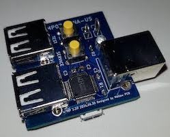
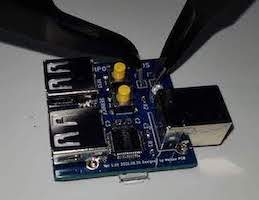

# ファームウェア更新
---
## 前置き
ファームウェア更新は、WebUSB APIを用いて、このページ上から行います。
ChromeまたはWebUSBの有効になったChromium系のブラウザにてご利用下さい。

## 準備
下の写真で白丸で囲まれた部分にスルーホールが4つあります。
まずは電源を入れていない状態で、黄色で結んだ対と赤で結んだ対（距離が近い対）を短絡します。
これによりJVS端子にUSB用のデータ線（D+/D-）を接続し、コンピュータとのUSB接続を可能にします。

ここでは簡単な方法をいくつか紹介します。

まずは1枚目の写真も針金のような物をアーチ状に曲げて穴に刺す方法。
ホチキスの芯などでも作成可能ですが細すぎると接触が悪くなるかもしれません。

2枚目のピンセットを使った方法も、大胆に見えますが、作業も簡単でしっかり接続されるのでオススメです。
ただ、ピンセットを複数持っている人は少ないかも。

一番の正攻法は3枚目のピンヘッダを取り付けてジャンパーピンで繋ぐ方法です。
ただしハンダ付けが必要なので万人向けではありません。

## コンピュータとの接続
まずは基板上のSERVICEボタン（中央付近のボタン）を押しながらmicro USBから給電開始します。
SERVICEボタンが正しく認識されると、LEDランプが消灯したままのファームウェア更新モードになります。
点滅してしまった場合は通常モードで起動しているため、もう一度電源の接続からやり直します。

これとは別にUSB Type AからType Aに繋ぐ特殊なケーブルを1P用端子に接続する方法もあります。
この場合は端子のショートや電源接続は不要です。SERVICEを押しながらPCに接続するだけで更新可能です。

うまくファームウェア更新モードで起動したら、JVS端子を使ってコンピュータとUSBで接続します。
この際、USB端子にはゲームコントローラ等を挿さないで下さい。特に1P側の端子はJVS端子の信号と衝突します。

## WinUSBの設定（Windowsで初回のみ）
デバイスを初めて接続した場合、デバイスマネージャーに不明なデバイスとして表示されます。
複数表示されている場合は、プロパティの詳細に`USB\VID_4348&PID_55E0\...`と表示されているデバイスが対象とするデバイスです。
このデバイスに対し、システム提供のWinUSBと呼ばれる標準ドライバを割り当てる必要があります。

設定方法の詳細についてはMicrosoft公式のドキュメント
「[システム提供のデバイス クラスを指定して WinUSB をインストールする](https://docs.microsoft.com/ja-jp/windows-hardware/drivers/usbcon/winusb-installation#installing-winusb-by-specifying-the-system-provided-device-class)」
に書かれていますので、この手順に従って設定して下さい。

インストール時にエラーが発生する場合、何回か試すと成功するとの報告があります。
この不具合に関してはチップ内蔵のブートローダ、あるいはWindows側の問題のため、改善策は今の所ありません。

## ファームウェアの選択
ページ一番下のメニューから書き込みたいファームウェアのバージョンを選びます。
選択後に書き込みボタンを押すと、以下のようなプロンプトが現れます。

USBのベンダーIDと製品IDで絞って選択画面を出していますので、基本ここには1つの選択肢しか現れません。
複数出た場合は、同じチップを搭載したデバイスがファームウェア更新モードで接続されていないか確認して下さい。
この状況はまず無いかとは思いますが……。
一方で、何も表示されない場合には以下の点を確認してみて下さい。

- 準備で行ったスルーホールの短絡がうまくいっていない、または接続が不安定
- micro USBから電源が供給されていない
- 電源は供給されているが、SERVICEボタンを押しながらファームウェア更新モードにしていない

出荷時のファームウェア書き込みも同等の方法を使っているため、初期不良の可能性はありません。
かならず上記のいずれかの問題が起きているはずですので、ゆっくりと確認してみましょう。

プロンプトが正しく表示されていたら、表示されているデバイスを選択し「接続」ボタンを押します。
書き込みが始まり、プログレスバーが更新されます。
書き込み中のトラブルで更新が失敗しても壊れませんので安心して下さい。
継続して再書き込みを行えば問題ありません。
もし、繰返しエラーが発生する場合には連絡を頂けたら調査します。

## 動作確認
ファームウェア更新が正常終了したら、コンピュータから切断し、micro USBからの電源を供給し直して下さい。
通常モードで起動した際にLEDが正しく点滅するようなら、更新は成功です。
JVS I/Oとして利用する前、特にジャンパーピンを実装した人は、忘れずにスルーホールの短絡を解除して下さい。
うっかり短時間の間ならJVSとして認識されない程度で済むと想います。
気づかずに長時間通電した場合、USB用の信号とJVS用の信号が衝突し、システムボードやIONA-USの故障に繋がります。

## ファームウェア更新履歴
- Ver 1.00 展示用サンプルに搭載されたバージョンでコインが減らないバグがあります
- Ver 1.01 初期製品出荷版
- Ver 1.02 USBホストの動作で仕様違反があったので修正し、対応コントローラを追加しました
- Ver 1.02a 他のコントローラ利用後にXbox系のコントローラを接続した際の動作不良を修正し、対応コントローラを追加しました
- Ver 1.03 複合デバイスとREMOTE WAKEUPの対応を改善し、対応コントローラを追加しました
- Ver 1.04 対応コントローラを追加しました
- Ver 1.10 ツインスティックモードを追加しました
- Ver 1.20 NAOMI麻雀モードを追加しました
- Ver 1.21 JVS電気特性の向上
- Ver 1.22 レイアウト設定モードに入るには0.5秒以上の同時押しが必要になりました
- Ver 1.23 コントローラ接続時に電源が安定するまで少し長く待つようにしました
- Ver 1.24 Ver 1.33の修正を取り込んだ安定版
- Ver 1.30 アナログ０−３に対し、P1アナログX/Y、P2アナログX/Yを割り当てました
- Ver 1.31 ガンコン3に対応しました
- Ver 1.32 ロータリーコントローラ2ch追加、P1アナログX/Yを割り当てました
- Ver 1.33 v1.20基板以降でJVSシステムとの相性問題が改善します
- Ver 1.34 アナログを4chに減らしGuilty GearシリーズでI/Oエラーが出ないよう修正、兎でD/H/L/ポンが反応しない問題に対応しました
- Ver 1.35 SERVICE+TEST長押し中も入力が効くように修正、設定モードには0.5〜5秒押し続けた時のみ移行
- Ver 1.40 アナログレイアウト、オプション設定を追加し、画面ポジション入力に対応しました
- Ver 1.41 namco NA-JV互換モードと各種オプション設定を追加しました
- Ver 1.42d メインIDコマンドや一部のnamco固有コマンドに正常応答を返すように変更しました

## ファームウェアの互換性
Xbox 360、Xbox Oneシリーズの規格に対応したコントローラは基本的に安定して動くはずです。
それ以外のUSB HIDデバイスについては、別のコントローラに対応する際に、うまく動作しなくなる可能性がゼロではありません。
以下に挙げたデバイスについては、デスクリプタの内容を把握し、実機ではないですが自動テストで互換性を確認するようにしています。
報告していただいたデバイスについても随時追加予定ですので、ここにないデバイスを継続的に使いたい場合は報告して頂けると幸いです。

またファームウェア1.40から保存する設定のフォーマットが変更されたため、異なるフォーマットを使用するファームウェアに更新した場合、設定は全て初期化されます。

|デバイス名称|確認バージョン|備考|
|-|-|-|
|(Xbox 360規格コントローラ)|1.00|1.02a以降推奨|
|(Xbox Oneシリーズ規格コントローラ)|1.00|1.02a以降推奨|
|(Bootモード対応キーボード)|1.20|NAOMI麻雀モードに対応|
|ガンコン3|1.31||DeathCrimson OX対応|
|ホリパッドFPSプラス for PlayStation 4|1.00|PS3モードも対応|
|ワイヤレスコントローラー（DUALSHOCK 4 - CUH-ZCT1J）|1.02||
|ワイヤレスコントローラー（DUALSHOCK 4 - CUH-ZCT2J）|1.03||
|ホリパッドミニ for Nintendo Switch|1.00||
|Nintendo Switch Proコントローラー|1.04||
|Nintendo Switch Joy-Con 充電グリップ|1.04||
|CYBER・アーケードスティック|1.23||
|6B Controller (メガドライブミニ)|1.02a||
|Xin-Mo Controller (*1)|1.20||

(*1) パソケード フルHDテーブル筐体 PS3ドッキングモデル にて仕様されているコントローラ

---
## ファームウェア更新
以下は実際にファームウェア更新を行うためのUIです。書き込みボタンにより実際に更新されます。
動作確認が不十分でバグも確認されているVer 1.03は選択できないようにしました。

Ver 1.4x系列は実験用のバージョンで十分なテストは実施されていません。
最も新しいVer 1.3x系のバージョン（デフォルトで選択済み）が最新の安定バージョンになります。

<select id="version">
<option>Ver 1.00</option>
<option>Ver 1.01</option>
<option>Ver 1.02</option>
<option>Ver 1.02a</option>
<option>Ver 1.04</option>
<option>Ver 1.10</option>
<option>Ver 1.20</option>
<option>Ver 1.21</option>
<option>Ver 1.22</option>
<option>Ver 1.23</option>
<option>Ver 1.24</option>
<option>Ver 1.30</option>
<option>Ver 1.31</option>
<option>Ver 1.32</option>
<option>Ver 1.33</option>
<option>Ver 1.34</option>
<option selected>Ver 1.35</option>
<option>Ver 1.40</option>
<option>Ver 1.41</option>
<option>Ver 1.42d</option>
</select>
<button onclick="flash();">書き込み</button>

| | |
|-|-|
|書き込み|0% <progress id="progress_write" max=1 value=0></progress> 100%|
|検証|0% <progress id="progress_verify" max=1 value=0></progress> 100%|

結果
<pre id="error"></pre>
