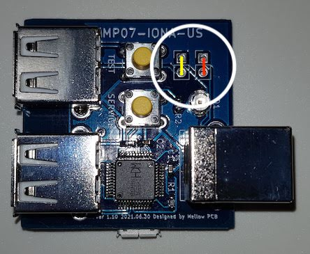
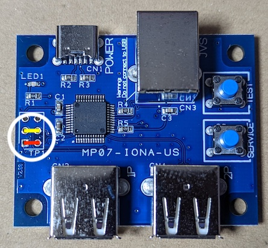
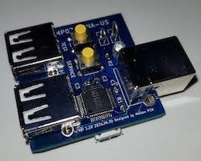
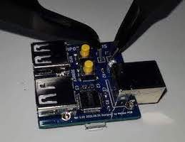
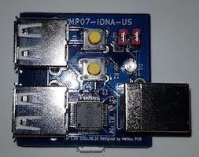
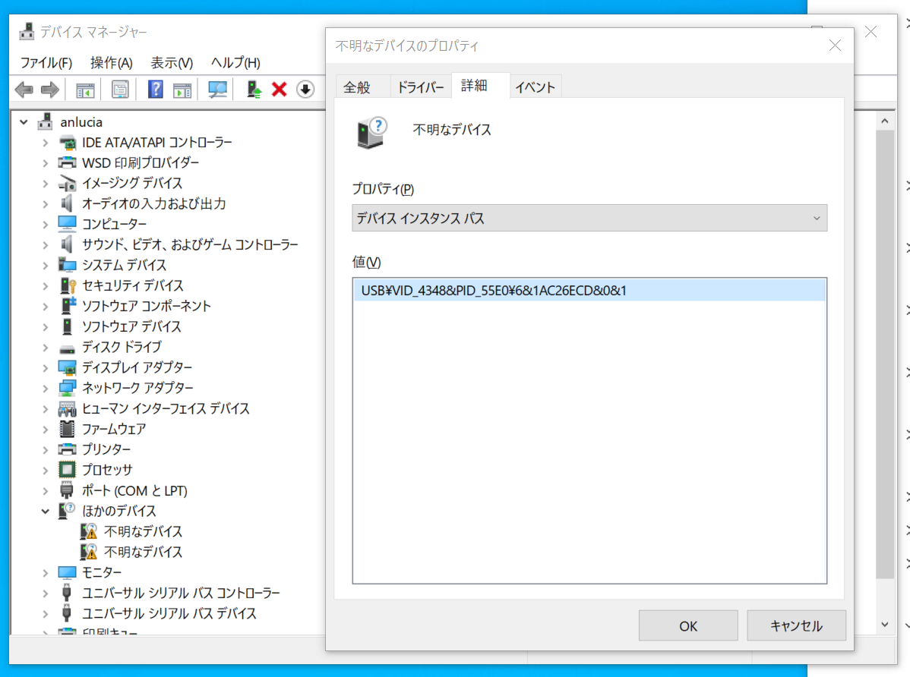
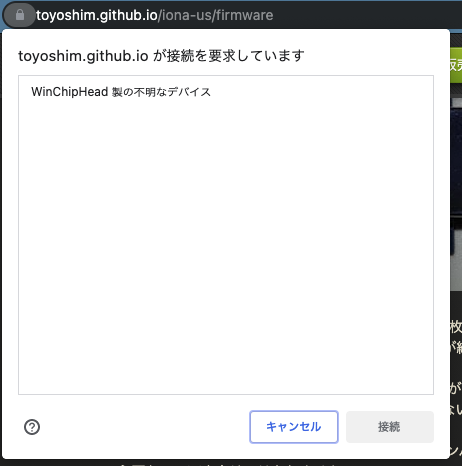

# Firmware Updates
---
## Caution
You can update your device's firmware to support more devices or fix issues here.
But as this page uses WebUSB API, you need to visit by Google Chrome or Chromium based browser that enables WebUSB API support.

## Preparation (for older v1/v2 boards)
This section is for v1/v2 boards. V3 board doesn't have through-holes. You need to use P1 port with Type-A to A special cable.

There are 4 through-hole on the IONA board as you can see in the white circle below.
Before supplying power, you need to shorten the yellow hole pair and the red hole pair respectively.
This allows the JVS port to use USB data line, D+ and D-, to communicate with PC over USB protocol.

Here, we introduce some simple ways to shorten the holes.

The first approach is to use a thin wire arch.
You may be able to use a staple, but it might be too thin to provide a stable connection.

The second one is to use two pairs of tweezers.
It may look a wild way, but actually it's very easy to get a stable connection.
It's recommended if you have two pairs of tweezers.

The last one is the ideal approach.
You install pin headers, and connect them with jumpper pins.
As it needs soldering, it isn't a good way for end users.

## Connect to PC
First, you need to keep the SERVICE button on the board pressed, then start supplying the power.
If the SERVICE button is correctly kept pressed until it boots, LED will not be on.
This is the signal that IONA boots to the firmware update mode.
If LED blinks, IONA runs in a normal mode, and you need to power off, and retry.

Alternatively, you can use a special USB cable from Type A to A.
You can connect your PC and 1P connector by such cable with pressing SERVICE to enter the firmware update mode.
You should not connect power supply and don't need jumpers.

Once it boots to the firmware update mode, connect IONA to your PC over USB via JVS port.
You should not connect a gamepad to the P1 USB port. It conflicts with the USB connection to the PC host, and makes communication unstable.

## WinUSB Settings (only for the first time on Windows)
When you connect IONA to your PC first time, it appears as an unknown device in the device manager.
If there are multiple unknown devices, IONA is the one that shows `USB\VID_4348&PID_55E0\...` at the property in details tab.
You need to install the system provinding default driver called as WinUSB for the device.

You can follow the instruction explained at the Microsoft official site, [Installing WinUSB by specifying the system-provided device class](https://docs.microsoft.com/en-us/windows-hardware/drivers/usbcon/winusb-installation#installing-winusb-by-specifying-the-system-provided-device-class).
[Here](https://www.youtube.com/watch?v=5yzpc2vI_94) is a movie that captures how to install the WinUSB driver on Windows 11.
If you feel the explanation in the site is difficult, this may help. You wouldn't see anything different on Windows 10.

Some users said retry will help if installation failed.
As this firmware update mode is provided by the chip vendor, I have no other ideas to mitigate this problem.

## Firmware Selection
You can pick up any firmware version you install.
When you push the flash button after selecting the firmware version, you will see a prompt as below.

You will see only devices that have a specified vendor ID and product ID. Thus, you will see only one choice here usually.
If you see multiple choices, another device that uses the same chip by chance would be connected in a firmware update mode to your PC. It should rarely happen, but just in case.

If you can see no choice, please check if there are following errors.

- Through-holls are not shortened correctly, or connection is unstable.
- Does not supply power over micro USB.
- Power is supplied, but doesn't boot to the firmware update mode with the SERVICE button.

As the initial firmware is also flashed at this site, you can expect it just works unless it is damanged after shipping.
So, probably you can find one of these issue, and will solve it.

If you can see the prompt as expected, select the device and press the connect button.
It starts flashing, and following UIs show it's progress.
Even if it fails during flashing, device won't be broken, and you can just retry safely.
Boot mode should not be broken by flashing.

If you see a persistent issue, please contact the author.

## Confirmation
One the firmware update finishes, please disconnect IONA from your PC, and stop supplying power to reboot.
If it bookts and starts blinking after supplying power again, you succeeded the update.
Please ensure the shortened pins are open again before connecting it to JVS systems.
It may be ok if it does not long, but it may damage the device to connect over JVS with through-holls shortened.

## Firmware History
- Ver 1.00 Sample for KVClab., there is a bug that coin could not be decreased.
- Ver 1.01 Initial firmware for the first lot.
- Ver 1.02 Fix USB host behaviors' spec violation, and add some more device supports.
- Ver 1.02a Fix Xbox controller unstability issue, and add some more device supports.
- Ver 1.03 Improve composite device and REMOTE WAKEUP support, and add some more device supports.
- Ver 1.04 Add some more device supports.
- Ver 1.10 Add twinstick mode.
- Ver 1.20 Add NAOMI Mahjong mode.
- Ver 1.21 Improve JVS electrical characteristics.
- Ver 1.22 Requre buttons pressed over 0.5 seconds to enter the layout mode.
- Ver 1.23 Wait more time before start a reset sequence on detecting device.
- Ver 1.24 Stability update to backport Ver 1.33 changes.
- Ver 1.30 P1 analog X/Y, P2 analog X/Y are assigned to analog 0-3.
- Ver 1.31 Guncon3 support.
- Ver 1.32 P1 analog X/Y are also assigned to newly added 2ch Rotary inputs.
- Ver 1.33 Improved JVS compatibility for v1.20+ PCB.
- Ver 1.34 Reduce Analog channel to 4ch to avoid I/O error on Guilty Gear series, and fix the issue D/H/L/Pon are not responsible for Usagi.
- Ver 1.35 Allow to send inputs even while pressing SERVICE+TEST. You can enter the settings mode iff you keep them pressed for 0.5-5.0 sec.
- Ver 1.40 Add analog layout, option config, and screen position input support.
- Ver 1.41 Add namco NA-JV compatible mode and several option conmfigs.
- Ver 1.42d Changed to ack with successful status for the main ID command and namco vendor specific commands.
- Ver 1.43 Changed as booting with TEST button pressed will flip the JVS signal level adjustment option.
- Ver 1.44 Support the Brook XB Fighting Board in the default X-One mode. Also fix detection issues on Xbox controllers.
- Ver 1.45 Fixed the analog lever config polarity, and add a new setting to disable analog inputs.
- Ver 1.46 Support exA-Arcadia's JVS Dash (high-speed mode), and adjust options and led controlls.
- Ver 1.47 Support GP2040.
- Ver 1.48 Works with all IONA-US boards including v3 boards.
- Ver 2.00 Major update to modify user settings at the support web page.
- Ver 2.01 Fix a bug that service button doesn't work if no gamepad is connected, adjust Xbox controller's trigger input range so to reach the peak, and Guncon3 support improvements with a bug fix.
- Ver 2.02 Add namco TSS-I/O compat ID, and support button state invert feature.
- Ver 2.10 Improve JVS response latency to stabilize. This will resolve I/O error issues.
- Ver 2.11 Improve functional compability on 3 namco modes.
- Ver 2.12 Zapper calibration and better compatibility for TSS-I/O, and persistent settings.
- Ver 2.13 CYBER STICK support for After Burner Climax!
- Ver 2.14 G29 Driving Force Race Wheel support for racing games.
- Ver 2.15 Support 8BitDo SNK NEOGEO controller.
- Ver 2.16 Bug fix on wrong RESET response that fixes compatibility issue with exA 1.6.0+.
- Ver 2.17 Support DUALSHOCK3.
- Ver 2.18 Support HORI FLIGHTSTICK for PlayStation 4, and adjust bus RESET.
- Ver 2.19 Support Real Arcade Pro.N HAYABUSA, V3.SA later model, and adjust bus RESET again.
- Ver 2.20 Support GT Force Pro, and introduce experimental shift gear emulation.

## Firmware Compatibility
For v3 based PCBs, only v1.48 and v2.11+ work. For v1/v2 based PCBs, all firmwares work.
All controllers that conform Xbox 360, or Xbox One series protocols are expected to work fine.
Other USB HID devices support might get to be broken unexpectedly on supporting other new devices.
We know HID descriptors on following devices, and have some automated unit tests. So, it's expected to keep better compatibility. We can add more automated tests when you report device information.
If you find a device that isn't in the list, but works, it's a good idea to report information to get stable supports.

Also, the internal format to hold the user settings is changed at firmware Ver 1.40. As a reuslt, if you write a firmware those format is different from one for current firmware, all your configurations will be reset.

|Device Name|Confirmed Version|Note|
|-|-|-|
|(Xbox 360 protocol controllers)|1.00|1.02a and later are recommended|
|(XInput compatible controllers)|1.00|1.47 and later are recommended|
|GP2040 (*2)|1.47|Confirmed with Xbox 360 compatible mode|
|(Xbox One series protocol controllers)|1.00|1.02a and later are recommended|
|8BitDo SNK NEOGEO controller|2.15||
|Brook XB Fighting Board|1.44|Work with the default X-One mode, and manual X-360 mode|
|Brook Universal Fighting Board|1.47|Work with the default PS4 mode|
|Brook PS4+ Fighting Board|1.47|Work with the default PS4 mode|
|(Keyboard supporting boot mode)|1.20|Supported by NAOMI Mahjong mode|
|REAL ARCADE PRO V3.SA|1.47|Later model (v1.2PCB) works only on 2.19+|
|REAL ARCADE PRO.H HAYABUSA|2.19||
|Guncon3|2.01||
|DUALSHOCK 3|2.17|Need to press PS button after the connection|
|Horipad FPS plus for PlayStation 4|1.00|PS3 mode also works|
|Wireless Controller（DUALSHOCK 4 - CUH-ZCT1J）|1.02||
|Wireless Controller（DUALSHOCK 4 - CUH-ZCT2J）|1.03||
|GT Force Pro|2.20||
|G29 Driving Force Race Wheel|2.14|Both PS3/PS4 modes|
|HORI FLIGHTSTICK for PlayStation4|2.18||
|Horipad mini for Nintendo Switch|1.00||
|Nintendo Switch Pro Controller|1.04||
|Nintendo Switch Joy-Con Charger Glip|1.04||
|Brook ZERO-PI Fighting Board|1.44|Work with the default Switch mode|
|CYBER Arcade Stick|1.23||
|6B Controller (MEGADRIVE mini)|1.02a||
|CYBER STICK (MEGADRIVE mini2)|2.13||
|Xin-Mo Controller (*1)|1.20||

(*1) Controller used by the Pasocade full HD table cab. PS3 dock model

(*2) Raspberry Pi Pico based open source firmware; https://gp2040.info/

---
## Firmware Update
This is the real UI to update firmware. Flash button will actually flash the chosen firmware.

When you update your firmware from v1 series to v2 series, you need to update the setting from the [setting](setting_en) page.
The latest 1.4x series, selected by default, is expected to be the latest stable version.

<select id="version">
<option>Ver 1.04</option>
<option>Ver 1.10</option>
<option>Ver 1.20</option>
<option>Ver 1.24</option>
<option>Ver 1.35</option>
<option>Ver 1.40</option>
<option>Ver 1.41</option>
<option>Ver 1.42d</option>
<option>Ver 1.43</option>
<option>Ver 1.44</option>
<option>Ver 1.45</option>
<option>Ver 1.46</option>
<option>Ver 1.47</option>
<option>Ver 1.48</option>
<option>Ver 2.01</option>
<option>Ver 2.02</option>
<option>Ver 2.10</option>
<option>Ver 2.11</option>
<option>Ver 2.12</option>
<option>Ver 2.13</option>
<option>Ver 2.14</option>
<option>Ver 2.15</option>
<option>Ver 2.16</option>
<option>Ver 2.17</option>
<option>Ver 2.18</option>
<option>Ver 2.19</option>
<option selected>Ver 2.20</option>
</select>
<button onclick="flash();">Flash</button>

| | |
|-|-|
|Write|0% <progress id="progress_write" max=1 value=0></progress> 100%|
|Verify|0% <progress id="progress_verify" max=1 value=0></progress> 100%|

Result
<pre id="error"></pre>
