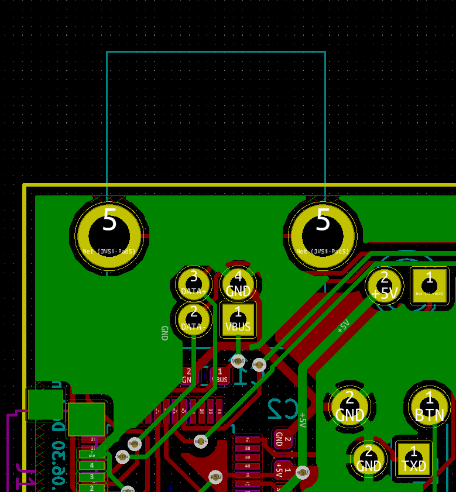
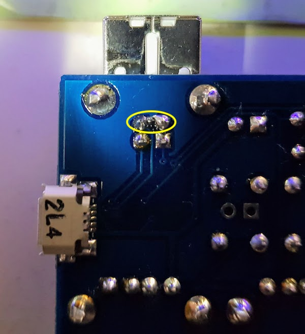

# 改造
---
## namco系基板から認識されない場合
ファームウェアだけでは解決できない電気特性的な相性問題がありました。JVS端子周りで以下のいずれかの改造をする事で互換性が改善します。

1) DATA-とGND間を0.1uFのコンデンサで接続する
2) DATA+とGND間を100Ωの抵抗で接続する

基板を裏面から見た図は以下のようになります。

実際に2)の修正を適用した例です。黄色円で囲まれた部分に表面実装の抵抗を挟み込んでいます。

