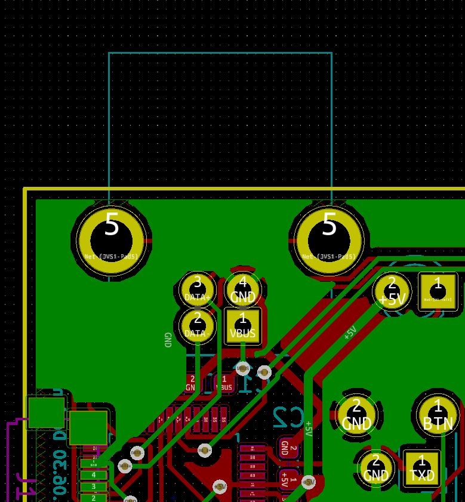
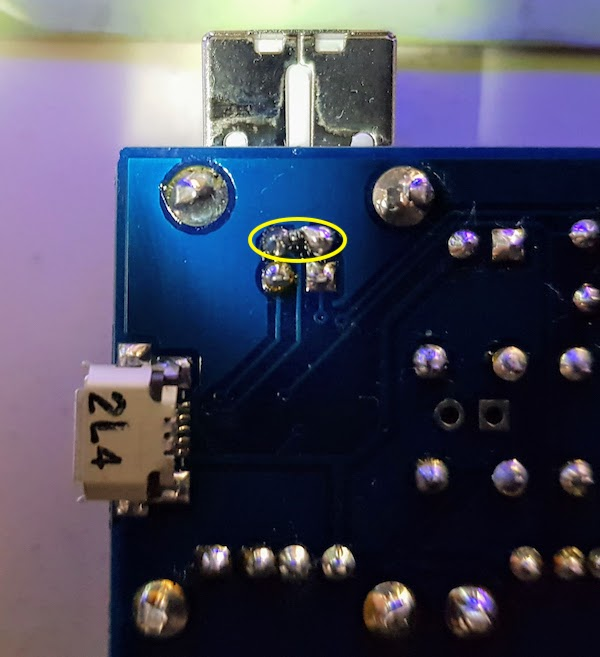

# MOD
---
## If namco's system boards don't recognize IONA
This electronical characteristics issue wasn't resolved by firmware update.
You need to apply one of following two mods for JVS bus.

1) Connect DATA- and GND over 0.1uF capacitor
2) Connect DATA+ and GND over 100Ω register

PCB's layout from the bottom side:

Following picture adopt 2), as inserting a surface mounted register between pins in the yellow circle.

